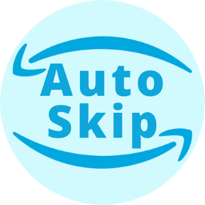

# Prime Auto-Skip

Automatically skip Ads, intros, Credits, etc. on Prime video.

## Installation

Download the extension here for [Chrome](https://chrome.google.com/webstore/detail/prime-auto-skip/akaimhgappllmlkadblbdknhbfghdgle).

## What it does

The script, "skipper.js", is injected into all urls containing "amazon.\*/\*/video".

It automatically skips Ads, intros, Credits, recaps, and anything else you don't want to watch on Prime video.

## Contributing

Everyone is welcome to contribute!

If you have any suggestions or Bugs, please open an issue.

## How it works

The addon is observing every mutation of the dom Tree of the Website.

On Prime video it matches buttons with the Css Classes:

* Intro: skipelement
* Credits: nextupcard-button
* Self promoting ads: .fu4rd6c.f1cw2swo
* Paid Content: .o86fri (yallow text indicates paid films)
  
The freevee ad text contains the ad length which is matched by 

* Freevee ads: .atvwebplayersdk-adtimeindicator-text

and then skipped by forwarding by the ad length -1 second which will fix a lot of issues.

## Disclaimer

Amazon Prime videos are trademarks and the author of this addon is not affiliated with these companies.
